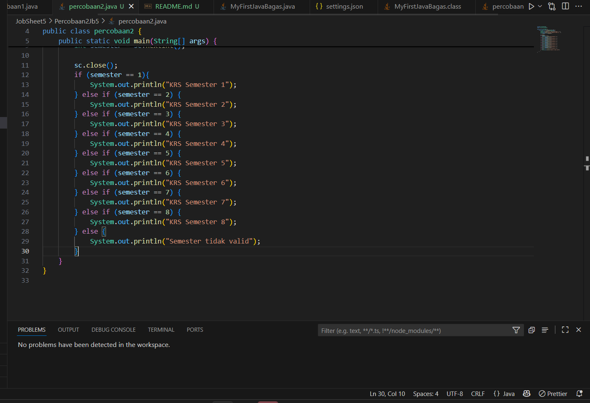

# JobSheet5 - Percobaan 2

## Pertanyaan

 1. Apa fungsi dari sintaks break?
 2. Apa peran dari sintaks default pada struktur pemilihan SWITCH-CASE?
 3. Buat file baru dengan nama ifElseCetakKRSNoPresensi.java. File ini berisi program hasil
    transformasi dari program cetak KRS menggunakan struktur SWITCH-CASE yang telah
    dibuat ke dalam bentuk IF-ELSE IF-ELSE.
 4. Commit dan push hasil modifikasi Anda ke Github dengan pesan “Modifikasi
    Percobaan 2”

## Jawaban

 1. Kegunaan break adalah untuk keluar dari case ketika suatu case terpenuhi.
 2. Peran default pada struktur Switch-Case adalah ketika semua case tidak terpenuhi maka default akan di jalan kan.
 3. 
 4. 