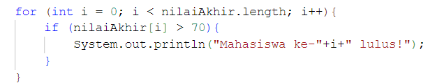
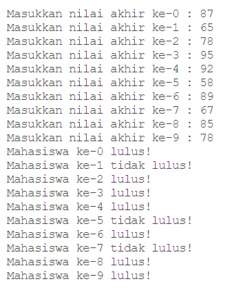

# JobSheet 9 - Percobaan 2

## Pertanyaan

 1. Ubah statement pada langkah nomor 5 menjadi seperti berikut ini:
    for(int i = 0; i < nilaiAkhir.length; i++){
        System.out.println("Masukkan nilai akhir ke-"+i+" :");
        nilaiAkhir[i] = sc.nextInt();
    }
    Jalankan program. Apakah terjadi perubahan? Mengapa demikian?
 2. Apa yang dimaksud dengan kondisi: i < nilaiAkhir.length ?
 3. Ubah statement pada langkah nomor 6 menjadi seperti berikut ini, sehingga program
hanya menampilkan nilai Mahasiswa yang lulus saja (yaitu mahasiswa yang memiliki nilai
> 70):

Jalankan program dan jelaskan alur program!
 4. Modifikasi program agar menampilkan status kelulusan semua mahasiswa berdasarkan
nilai, yaitu dengan menampilkan status mana mahasiswa yang lulus dan tidak lulus,
seperti ilustrasi output berikut:

## Jawaban

1. Adanya perubahan pada kode "10" yang diubah menjadi "nilaiAkhir.length" dimana saat program dijalankan hasilnya tetap sama yaitu menginput banyak nya nilai akhir. Namun yang membedakan ialah "nilaiAkhir.length" Menyesuaikan jumlah iterasi dengan panjang array yang sebenarnya. Sedangkan "10" angka tetap sehingga Memaksa iterasi sebanyak 10 kali, terlepas dari ukuran array.  

2. Yang dimaksud "i > nilaiAkhir.length" ialah Menyesuaikan jumlah iterasi dengan panjang array yang sebenarnya. Jika ukuran array berubah, loop tetap bekerja dengan benar. 
3. Berikut ialah hasil modifikasi program:  
