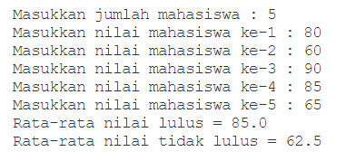

# JobSheet 9 - Percobaan 3

## Pertanyaan

 1. Modifikasi kode program pada praktikum percobaan 3 di atas (ArrayRataNilaiXX.java)
agar program dapat menampilkan banyaknya mahasiswa yang lulus, yaitu mahasiswa
yang memiliki lebih besar dari 70 (>70).
 2. Modifikasi program pada praktikum percobaan 3 di atas (ArrayRataNilaiXX.java) sehingga
program menerima jumlah elemen berdasarkan input dari pengguna dan mengeluarkan
output seperti berikut ini:

## Jawaban

1. Berikut ialah hasil modifikasi pada program dapat menampilkan banyaknya mahasiswa yang lulus, yaitu mahasiswa yang memiliki lebih besar dari 70 (>70):  

2. Berikut ialah hasil modifikasi pada program sehingga program menerima jumlah elemen berdasarkan input dari pengguna :  
