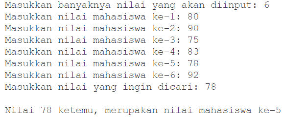
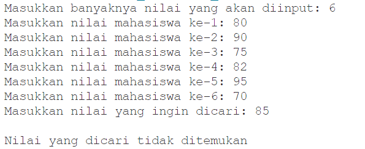

# JobSheet 9 - Percobaan 4

## Pertanyaan

 1. Jelaskan maksud dari statement break; pada baris ke-10 kode program percobaan 4 di
atas.
 2. Modifikasi kode program pada percobaan 4 di atas sehingga program dapat menerima
input berupa banyaknya elemen array nilai, isi array, dan sebuah nilai (key) yang ingin
dicari. Lalu cetak ke layar indeks posisi elemen dari nilai (key) yang dicari. Contoh hasil
program:

 3. Modifikasi program pada percobaan 4 di atas, sehingga program akan memberikan pesan
"Nilai yang dicari tidak ditemukan" jika nilai yang dicari (key) tidak ada di dalam array.
Contoh tampilan program sebagai berikut:

## Jawaban

1. Statement break; pada baris ke-10 dalam kode program percobaan 4 berfungsi untuk menghentikan perulangan for secara paksa saat kondisi tertentu terpenuhi.
2. Berikut ialah hasil modifikasi kode program pada percobaan 4 di atas sehingga program dapat menerima input berupa banyaknya elemen array nilai, isi array, dan sebuah nilai (key) yang ingin dicari. Lalu cetak ke layar indeks posisi elemen dari nilai (key) yang dicari:  

3. Berikut ialah hasil modifikasi  program pada percobaan 4 di atas, sehingga program akan memberikan pesan "Nilai yang dicari tidak ditemukan" jika nilai yang dicari (key) tidak ada di dalam array:  
